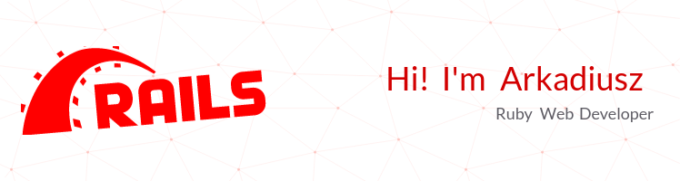

# My information
## 📫 How to reach me:

## ✍️ Currently learning:

## 🚀 Programming languages: 

## 🖸 Databases: 

## 📚 Frameworks and libraries: 

# Projects:
## Educational projects: 
- Simple game in Phaser: 
    - [🔗 Website](https://phaser-simple-game.vercel.app/) [📁 Repository](https://github.com/arrke/phaser-game-js/tree/main)
- Real time chat using Hotwire:
    - [📁 Repository](https://github.com/arrke/turbo-chat)
- Simple e-commerce  using Thymeleaf and Spring:
    - [📁 Repository](https://github.com/arrke/e-store)

# Stats

<!-- Here are some ideas to get you started:

- 🔭 I’m currently working on ...
- 🌱 I’m currently learning ...
- 👯 I’m looking to collaborate on ...
- 🤔 I’m looking for help with ...
- 💬 Ask me about ...
- 📫 How to reach me: ...
- 😄 Pronouns: ...
- ⚡ Fun fact: ...
-->
